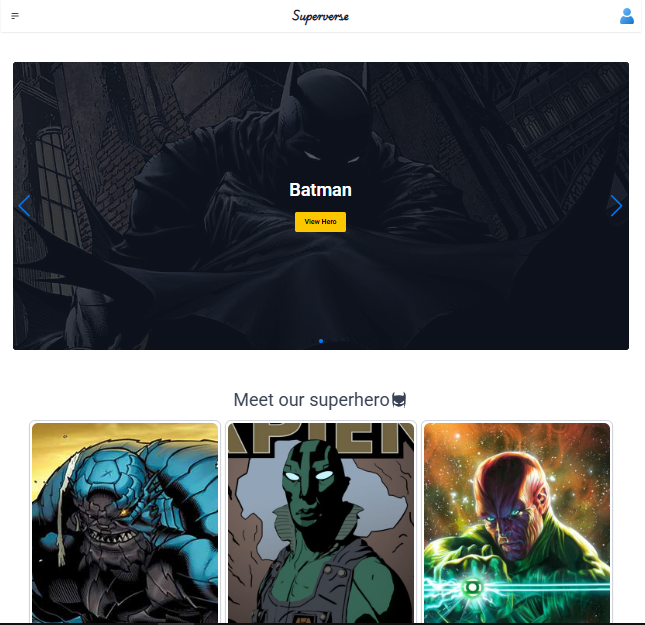

# Superverse

Superverse is a fan-made superhero database powered by the IMS_SuperHero API v1. Explore heroes from Marvel, DC, and beyond → search, sort, and discover amazing characters with detailed stats and images with pagination system.


## Preview Link

[](https://my-portfolio-simpleproject.vercel.app/)




## Technology

> _For developing_
1. [React v19.1](https://react.dev/learn/installation)
2. [Vite v7.1](https://vite.dev/guide/)
3. [React Router v6.28](https://reactrouter.com/6.28.0/start/tutorial#setup)
4. [Axios v1.11](https://axios-http.com/docs/intro)

> _For styling:_
1. [Tailwindcss v4.1](https://tailwindcss.com/docs/installation/using-vite)
2. [Daisyui v5](https://daisyui.com/)
3. [Flowbite v3.1.2](https://flowbite.com/docs/getting-started/quickstart/)
4. [SwiperJS v11](https://swiperjs.com/react)
5. [Animate On Scroll Library](https://michalsnik.github.io/aos/)
6. [Animate.css](https://animate.style/)
## API Reference

#### Get all items

```http
  GET https://superhero-api.innovixmatrixsystem.com/api/collections/superheros/records/
```

| Parameter | Type     | Description                |
| :-------- | :------- | :------------------------- |
| `api_key` | `string` | **Required**. get all data |

#### Get item

```http
  GET https://superhero-api.innovixmatrixsystem.com/api/collections/superheros/records/{id}
```

| Parameter | Type     | Description                       |
| :-------- | :------- | :-------------------------------- |
| `id`      | `string` | **Required**. Id of item to fetch |


## Setup

To run this project

```bash
  npm run install
```

